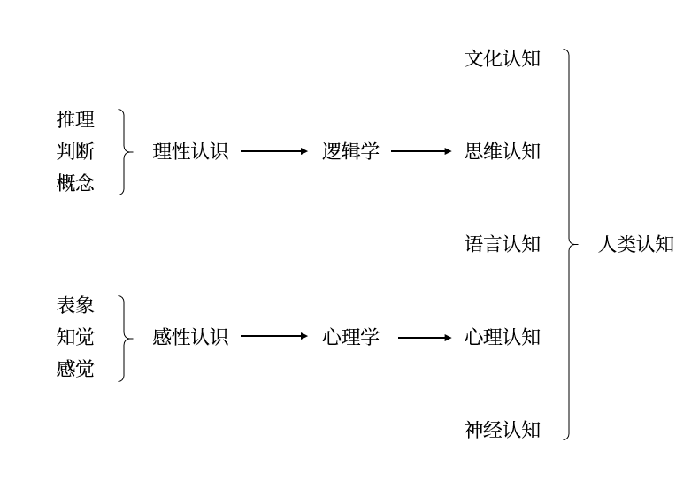

# 3 语言认知

## 3.1 符号与语言
### 3.1.1 符号学
1. 符号学是基于「人是符号的动物」这一基本判据，发展出一种以经验为基础的分析方法
    1. $\text{Saussure}$ 符号学（$\text{Semiology}$）：符号的性质以及支配这些符号的规律，更偏向语言学
    2. $\text{Peirce}$ 符号学（$\text{Semiotics}$ ）：关于符号的形式学说，更偏向逻辑学和哲学
2. $\text{Deacon}$ 的符号人类学：语言与大脑的关系
    1. 符号是语言的基础，比语言更基本
    2. 人类的思维是符号思维，即以抽象概念为基础，包括概念、判断与推理等诸形式的思维。符号思维触发了语言与脑的双重进化的进程，符号思维与语言思维之间没有本质的不同
3. 对语言符号研究的三分框架
    1. 语型学：符号的空间结构
        1. 词法：根据语言的形成规则，从语言的初始符号，经由形成规则得到语词的加工过程
        2. 句法：从语词根据句法规则得到语句的加工过程
    2. 语义学：符号的指称与意义
        1. 语义学通过对语言符号和现实世界的对象间建立映射关系来建立语言符号的意义
        2. 自然语言中，语词指称现实世界中的个体、性质或关系；语句指称的是现实世界中的事件
    3. 语用学：符号与其使用者的关系
        1. 影响语言意义的五大语用要素：说者、听者、时间、地点与语境
        2. 语用学的三个研究目标：语句在言说的语境中的意义；隐含与预设；言语行为

### 3.1.2 符号语言
1. 语言与认知
    1. 语言是人类认知与高阶认知的基础
    2. 人类以语言为基础，以思维和文化为特征的高阶认知能力是由神经和心理的初阶认知能力进化而来的
    
        <figure markdown>
            
            
        </figure>

        !!! note "$\text{Sapir}-\text{Whorf}$ 假说"
            1. 强式（语言决定论）：语言结构决定人的思维方式，并影响非语言的认知行为；不同语言的民族，其思维方式也不同
            2. 弱式（语言相对论）：被决定的认知过程因语言不同而不同，但语言并不完全地决定思维，而是在一定程度上影响人的思维
            3. $\text{Sapir}-\text{Whorf}$ 假说的重要推论
                - 语言结构影响人们对现实的认知结构（或者更为强式的表达是人们以与其语言结构相结合的结构来认识现实）
                - 语言以不同方式切分现实，但不存在切分世界的自然方式
                - 这种语言上的差异性是隐蔽或无意识的
                - 语言结构对人类认知的限制亦是无意识的，因此不同语言的观察者对同意现象的认知图像是不同的

2. 语言的特点
    1. 可分离性：语言可与语言的主体相分离，具有更广泛的传播范围
    2. 可组织性：仅以少数基本符号按一定规则组合，可以表达无穷的语句和意义
    3. 理智性：符号语言是理智的产物并服从理性的规则
    4. 可继承性：人类的符号语言可以为他人继承并代代相传
3. 语言的分类：信号语言与符号语言

    <figure markdown>
        
        
    </figure>

4. 语言与言语
    1. 语言：书面语言，即用文字来记录和表达的语言
    2. 言语：口头语言，现代语言学更注重对言语的研究，$\text{Vygotsky}$ 认为言语有两个基本功能
        1. 用于交际的功能，包括动物也有这种功能
        2. 用于心理过程，它以内心独白的方式来组织和促进认知

## 3.2 句法与语句结构
### 3.2.1 自然语言的句法结构
1. $\text{Saussure}$ 的结构主义语言学
    1. 语言是一个系统，各成分在系统中完全由其在系统中的相互关系界定
    2. 语言系统有不同层次，每一层次上的一些成分通过结合形成更高的层次，而且一个层次上的各种成分与其他层次上的各种成分形成对照，即每个层次的结构原理都是相同的
2. $\text{Chomsky}$ 的转换生成语法
    1. 转换生成语法形成时期：20 世纪 50 年代中期到 70 年代中期，主要成就是转换语法（$\text{TG}$）
        1. 句法结构理论（$\text{SS}$）：$\text{Chomsky}$ 主张把语义排除在语法之外
            - 短语结构规则：也称作重写规则，它试图用有限的规则来生成无限的句子。重写规则通过形式化方法和递归定义，生成一系列的短语结构
            - 转换规则：由重写规则生成一系列的短语规则，可分为词汇前结构和词汇后结构。前者由非终极符构成，称为深层结构，后者由终极符构成，称为表层结构语法
            - 形态音位规则：转换规则将深层结构的逻辑语法关系映射为表层结构的语言关系与语音关系
        2. 标准理论（$\text{ST}$）：包括深层结构与表层结构，深层结构即语义部分和语义规则，表现句子的语义；表层结构即语音部分和语音规则，表现句子的语言
            - 扩展的标准理论（$\text{EST}$）：虽然语义主要是由深层结构决定，但表层结构对语义解释也起一定的作用
            - 修正扩展的标准理论（$\text{REST}$）：将语义解释放到表层结构上，时期理论结构增加一个与语音表现并列的新层级，即逻辑形式表现
    2. 形式语法理论新的发展时期：20 世纪 70 年代后
        1. 管辖和约束理论（$\text{GBT}$）：$\text{Chomsky}$ 称其为 $\text{GB}$ 框架。语法系统包括词汇（词汇项和词汇规则）、句法（范畴规则与转换规则）、语音形式规则与逻辑形式规则
        2. 原则和参数理论（$\text{P&P}$）：对自现代语法诞生依赖就占有主导地位、并已经发展成型的、对语言研究的经典问题起指导作用的特殊方法
        3. 最简方案（$\text{MP}$）：在 $\text{P&P}$ 框架基础上发展起来的最新的生成语法理论
3. 普遍语法（$\text{UG}$）：说者知道一套适用于所有语言的原则即一些明确限定的参数，这些参数在不同的语言之间是各不相同的。语言的习得意味着如何将这些原则应用于某种特殊的语言，并对每一种参数了解它的值是否合适
    1. 语言能力：人类在句法和语义方面拥有的能力
        1. 能造出和理解数量无限的句子，其中包括从来没有听到过的句子
        2. 能辨认出哪些句子是合法的、可以被接受的
        3. 能辨认句子的结构
        4. 能辨别歧义、同义或释义现象
    2. $\text{Chomsky}$ 将语言学的目标总结为四个主要问题
        1. 何为语言知识
        2. 如何获得语言知识
        3. 如何运用语言知识
        4. 作为语言知识体系和语言知识运用的物质基础，其生理机制是什么
4. 生成转换语法的原则
    1. 生成语法是唯理论的
        1. 语法是描述的而非说明的：生成语法通过理论的描述来解释语言现象
        2. 语法应该是明确的：生成语法被假设为一种精确的规则系统，该系统无需依赖任何预先的语言知识
        3. 语言分析应该具有最大的普遍性：如果两个语法覆盖相同的语言范围，一个语法有两条不同的规则，零一个语法仅有一条规则，则后者优于前者
        4. 语法理论会产生普遍要求：生成语法的普遍原则注重形式公式的描述，这些原则无法再语言现象中直接观察到；相反，这些普遍原则的发现和检验涉及经验观察、方法论假设以及推理过程的复杂综合
    2. 生成语法是心理主义的
        1. 语法应表征语言能力而非语言行为：生成语法并不视图描述本地说话者的所有实际话语，因为语言是无穷的
        2. 语法应该是心理相关的：一种特殊的生成语法就是与知晓一种特殊语言的人的心脑相关的那样一种理论

### 3.2.2 其他句法结构
1. 传统逻辑：即 $\text{Aristotle}$ 逻辑，其句法结构的基本内容只有假言推理与三段论
    1. 假言推理：反应因果关系的推理，其中因果关系分为客观因果、主观因果和虚拟因果
    2. 三段论：表达由三种词项组成的三个判断之间的推理关系
2. 一阶逻辑：建立在形式语言的基础上的逻辑系统
3. 艺术符号系统：音乐、绘画、建筑、小说、诗歌及戏剧等

## 3.3 语义与意义理解
### 3.3.1 基本概念
1. 语言世界与符号世界
    1. 语言表达式：语言世界是由语言符号构成的集合，对语言符号进行排列形成的语词和语句统称为语言表达是
    2. 能指与所指：$\text{Saussure}$ 认为每一个语言记号都由两部分构成。通过能指与所指，人类在语言世界和现实世界间建立了指称关系的意义
        1. 能指：声音模式，语言符号本身
        2. 所指：语言符号指称的对象
2. 现实世界与可能世界
    1. 虚假概念：有些语言符号在现实世界中没有指称对象，即有内涵而无外延的概念，例如「孙悟空」
    2. 可能世界：$\text{Kripke}$ 建立的语义学框架，将现实世界扩展到可能世界，从而无例外地、一致地建立语言符号的指称与意义
3. 指称与意义
    1. 指称：一种映射关系，通过指称和映射可以在符号世界和可能世界（包括现实世界）之间建立关系
    2. 意义
        1. 语词的意义是它所指称现实世界或可能世界的某个对象
        2. 简单语句的意义是它所指称现实世界或可能世界的某个事件，如果指称的事件存在，那么这个语句是真的，否则是假的
        3. 复合语句的语义可以用真值函数方法建立

### 3.3.2 语义学
1. 真值函数语义学
    1. 形式逻辑的真值语义：命题或语句的逻辑意义是真与假，直言命题的真假是由其主谓项之间在现实世界或可能世界中的关系来确定的
    2. 命题逻辑的真值语义：利用真值函数（否定、合取、析取、蕴含与等值）将逻辑推理变为可计算的系统
2. 模型论语义学：$\text{Tarski}$ 语义与 $\text{Kripke}$ 的可能世界语义等

    !!! note "塔斯基语义的一般原理"
        1. 对象语言与元语言：
            1. 对象语言即语言系统中被作为研究对象的语言；元语言即用来指称对象语言的语言
            2. 对象语言 $\mathscr L$ 没有真假，元语言 $\mathscr M$ 含有关于对象语言的语义指称，例如谓词「在 $\mathscr L$ 中为真」或「在 $\mathscr L$ 中为假」
        2. 形式正确：定义 $\mathscr L$ 的真概念不在 $\mathscr L$ 中出现
        3. 实质充分：被定义的概念需要能用于真谓词的目的

3. 形式语义学
    1. 范畴语法：$\text{Frege}$ 建立语言表达式的范畴与它所指称的现实世界中的实体类型之间的相关性
        1. 实体类型包括个体词项、谓词、联结词与量词
        2. 对每一个逻辑类型、该类型的一个表达式所确定类型的实体作为其指称。
            - 个体词项指称现实世界中的实体
            - 一元谓词指称从个体到真值的函数；一元或二元逻辑联结词的指称也是一个真值函数
            - 量词的指称是领域中个体的数量
            - 陈述语句的指称是某种真值
    2. $\text{Montague}$ 语法：创建类似逻辑形式系统的英语部分语句系统，基于句法范畴和语义类型的对应和意义组合原则，给出语句系统的语义解释
        1. 类型$-$逻辑语法：更贯彻意义的组合原则，对自然语言的词条指派作为语义表现的 $\lambda-$词项和作为句法层面的范畴，依据间接的规则逐层并行推演，最后获得句子的范畴类型值  
            范畴的语法逻辑：将模态逻辑方法应用到自然语言领域
        2. 广义量词理论：从 $\text{Montague}$ 对自然语言量化句的研究获得启发，将量词的概念推广，深入说明自然语言的限定词和名词短语的量化意义及其语义共性，用推广的两次概念表述数学理论
        3. 话语表现理论：处理句子之间名词与代词的照应关系以及动词在时间方面的联系，对句子序列的语义分析采用渐进递增的动态方法，确立关于自然语言语义表现的推演系统  
            动态语义学：从类似程序语言状态转换的动态角度来处理自然语言的语义现象，据此确立动态谓词逻辑和普通动态逻辑系统
        4. 情境语义学：关注命题态度句的认知心理特征，运用信息条目的方式描述自然语言的语义语用现象

## 3.4 语用与语言交际
1. 分析哲学的两次语言转向

    |       项目       |                         理想语言学派                         |                         日常语言学派                         |
    | :--------------: | :----------------------------------------------------------: | :----------------------------------------------------------: |
    |     活跃时间     |                          二十世纪初                          |                      二十世纪三十年代后                      |
    |     分析工具     |                           数理逻辑                           |                           语言哲学                           |
    |     代表人物     | $\text{Frege}$、$\text{Russell}$、前期 $\text{Wittgenstein}$、$\text{Carnap}$、$\text{Quine}$、$\text{Dummett}$ | 后期 $\text{Wittgenstein}$、$\text{Moore}$、$\text{Austin}$、$\text{Strawson}$、$\text{Ryle}$ 等诸牛津学派人物 |
    | 对日常语言的认识 | 日常语言不精确，哲学上一些无意义的问题就是日常语言的歧义引起的，应该构造精确的人工语言消除混乱 | 日常语言本身是完善的，由日常语言的应该建立对日常语言的分析，而不是抛弃日常语言，没有必要构建人工语言 |
    | 对形而上学的态度 | 拒斥形而上学；哲学是以研究语言的意义为基础的，从而使形而上学的思想混乱得以澄清 | 许多形而上命题具有启发性，日常语言哲学的任务是排除形而上学的混乱，找出有价值的部分 |

2. 言语行为理论：由 $\text{Austin}$ 创立，$\text{Searle}$ 发展的语言理论
3. 语用交际模型
    1. 五大语用要素
    2. 三个层次的加工过程：句法加工、语义加工与语用加工；其中说话时自上而下的加工，听话是自下而上的加工
