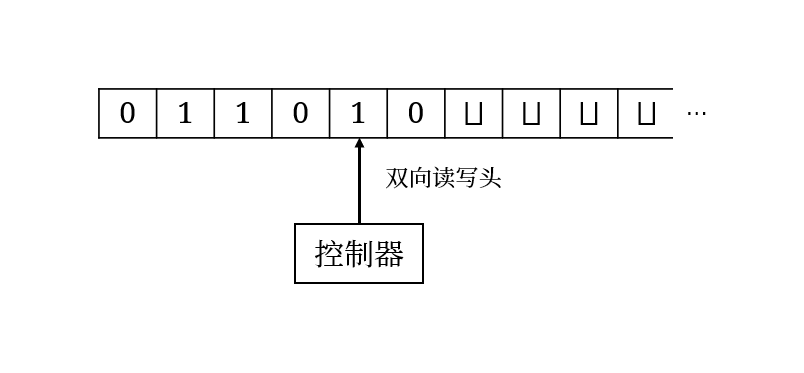

# 4 短语结构文法

## 4.1 Turing 机
### 4.1.1 基本模型
1. 一个确定的单带 $\text{Turing}$ 机（$\text{TM}$）是一个八元组 $M = (Q, \Sigma, \Gamma, \delta, B, s, t, r)$，其中
    - $Q$ 是有穷状态集
    - $\Sigma$ 是有穷输入字母表
    - $\Gamma$ 是有穷带字母表且 $\Gamma \supseteq \Sigma$，表示带上可以放置的所有符号
    - $\delta: Q \times \Gamma \to Q \times \Gamma \times \left\{L, R\right\}$ 是转移函数，$L$ 表示读写头左移，$R$ 表示读写头右移
    - $B \in \Gamma - \Sigma$ 是空白符号，一般用 $\sqcup$ 表示，输入字母表一定不能出现
    - $s \in Q$ 是初始状态
    - $t \in Q$ 是接收状态
    - $r \in Q$ 是拒绝状态

    <figure markdown>
        
        
        
 \$ 

    </figure>

    1. $\text{Turing}$ 机的瞬时描述（$\text{ID}$）是一个特殊的符号串 $\alpha_1 q \alpha_2$，

### 4.1.2 变式

## 4.2 不可判定性
