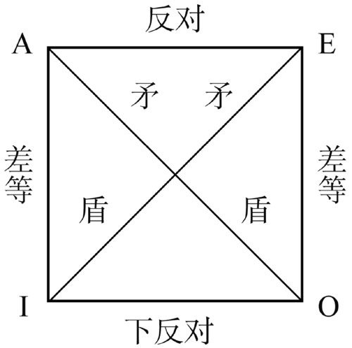

# 2 命题与推理

1. 命题: 表达判断的语句, 命题一定能判断真假
    1. 判断: 对事物情况所有断定的一种思维形式
    2. 语句: 只有表达判断的语句才是命题, 不同的语句可能表达相同的命题
2. 推理: 从一个已知的命题出发推出另一个新命题的思维形式
    1. 由其出发进行推理的一直命题称为前提; 把由一直命题所推出的命题称为结论
    2. 演绎推理 (从一般到特殊), 归纳推理 (从特殊到一般), 类比推理 (从特殊到特殊)

## 2.1 简单命题
### 2.1.1 直言命题
1. 概念: 断定事物具有某种性质的命题, 具有主项 $\mathrm{S}$, 谓项 $\mathrm{P}$, 联项和量项
    - 根据联项 (是或不是) 的不同, 可以分为肯定命题或否定命题, 根据量项 (所有或有的) 的不同, 可以分为全程命题 (包括单称命题) 或特称命题
    - 周延性: 在一个命题中, 其主项或谓项的全部外延被做了断定, 那么这个命题的主项或谓项就是周延的
2. 四种命题形式: 全称肯定命题 ($\mathrm{SAP}$, 左上), 全称否定命题 ($\mathrm{SEP}$, 右上), 特称肯定命题 ($\mathrm{SIP}$ 左下) 以及 特称否定命题 ($\mathrm{SOP}$, 右下)
    1. 利用 Venn 图, 可以表示概念外延间各种不同关系的图解. 其中, 利用阴影部分表示不存在, 用 「$+$」 表示存在
    2. 就主项而言, 全称命题是周延的; 就谓项而言, 否定命题是周延的 

    

3. 从下表主谓项之间的关系与不同命题形式之间的真假关系， 可以看出以下命题形式之间的关系, 如图称为「逻辑方阵」

    | 主谓项关系 | $\mathrm{SAP}$ | $\mathrm{SEP}$ | $\mathrm{SIP}$ | $\mathrm{SOP}$ |
    | :--------: | :------------: | :------------: | :------------: | :------------: |
    |  全同关系  |       真       |       假       |       真       |       假       |
    |  真包含于  |       真       |       假       |       真       |       假       |
    | 真包含关系 |       假       |       假       |       真       |       真       |
    |  交叉关系  |       假       |       假       |       真       |       真       |
    |  全异关系  |       假       |       真       |       假       |       真       |

    1. 反对关系: 指全称肯定命题与全称否定命题
    2. 矛盾关系: 指全称肯定命题与特称否定命题或全称否定命题与特称肯定命题
    3. 差等关系: 指全称肯定命题与特称肯定命题或全称否定命题与特称否定命题
    4. 下反对关系: 指特称肯定命题与特称否定命题

    

4. 直言命题的推理
    1. 命题变形法: 两种方法可以结合使用
        1. 换质法: 改变命题的联项, 即肯定命题与否定命题的相互转换
        2. 换位法: 改变命题主项和谓项位置的方法

        |     原命题     |         换质命题          |    换位命题    |
        | :------------: | :-----------------------: | :------------: |
        | $\mathrm{SAP}$ | $\mathrm{SE\overline{P}}$ | $\mathrm{PIS}$ |
        | $\mathrm{SEP}$ | $\mathrm{SA\overline{P}}$ | $\mathrm{PES}$ |
        | $\mathrm{SIP}$ | $\mathrm{SO\overline{P}}$ | $\mathrm{PIS}$ |
        | $\mathrm{SOP}$ | $\mathrm{SI\overline{P}}$ |    不能换位    |

    2. 依据逻辑方阵可以推断出一些命题的的真假情况, 在同一素材下有以下性质成立
        1. 反对关系: 若一个真, 则另一个为假, 反之不成立
        2. 矛盾关系: 两个命题必为一真一假
        3. 差等关系: 若全称命题为真, 则特称命题必定为真

5. 直言三段论: 两个包含共同项的直言命题作为前提推出一个直言命题为结论
    1. 三段论的结构
        1. 小项 $\mathrm{S}$: 在结论中作为主项的概念
        2. 大项 $\mathrm{P}$: 在结论中作为谓项的概念
        3. 中项 $\mathrm{M}$: 在前体中出现而在结论中没有出现的概念
    2. 三段论的公理与规则: 一类对象的全体具有或不具有某个性质, 那么这类对象的一部分也具有或不具有同样的性质
        1. 在一个三段论内, 有且仅有三个不同的概念: 集合概念和普遍概念不是相同的概念
        2. 中项在前提中必须周延至少一次: 若中项中前提一次也没有被断定过其全部外延, 则大小项都只与中项的一部分外延发生联系
        3. 大项或小项如果在前提中不周延, 则在结论中也不周延: 若前提中的大小项只被断定了部分外延, 则结论断定的对象超出了前提断定的对象范围
        4. 两个否定前提不能推出结论, 前提之一是否定的当且仅当结论是否定的
        5. 两个特称结论不能推出结论, 前提之一是特称的, 则结论是特称的
    3. 三段论的格与式
        1. 格: 中项在前提中位置的不同而形成的三段论的各种形式
        2. 式: 由于 $\mathrm{A, E, I, O}$ 四种命题在前提和结论中组合的不同形式形成的三段论的各种形式

        
        
        !!! note "各个格的规则"
            1. 第一格的大前提必须全称, 小前提必须肯定: $\mathrm{AAA,(AAI),AII,EAE,(EAO),EIO}$
            2. 第二格两个前提中必须有一个否定命题, 大前提必须为全称命题: $\mathrm{AEE,(AEO),AOO,EAE,(EAO),EIO}$
            3. 第三格小前提必须为肯定命题, 且结论必须为特称命题: $\mathrm{AAI,AII,EAO,EIO,IAI,OAO}$
            4. 第四格的前提如果有一个是否定命题, 则大前提必须是全称命题; 否则小前提必须是全称命题: $\mathrm{AAI,AEE,IAI,EAO,EIO,(AEO)}$

            带括号的称为弱式, 即本应得出全称结论但得出了特称结论的式子

6. 其他三段论
    1. 复合三段论: 由两个或以上的三段论构成的特殊的三段论形式. 前进式 (后退式) 的复合三段论是以前一个三段论的结论作为后一个三段论的大前提 (小前提) 的三段论
    2. 省略三段论: 省去一个前提或结论的三段论

### 2.1.2 关系命题
1. 关系命题: 断定事物之间的关系的命题, 包括关系项 $R$, 关系者项 (包括前者项和后者项) 以及量项 (所有, 部分), 记为 $aRb$
2. 关系的性质
    1. 对称关系: 如果 $aRb$ 为真时 $bRa$ 一定为真  
        反对称关系: 如果 $aRb$ 为真时, $bRa$ 一定为假
    2. 传递关系: $aRb$ 与 $bRc$ 为真时, $aRc$ 一定为真  
        反传递关系: $aRb$ 与 $bRc$ 为真时, $aRc$ 一定为假
3. 关系推理
    1. 直接的关系推理: 对称性关系推理与反对称性关系推理
    2. 间接的关系推理: 传递性关系推理与反传递性关系推理
4. 混合关系三段论: 一个前提是两项的关系命题, 另一个前提是性质命题, 结论是两项的关系命题
    1. 性质命题必须是肯定的
    2. 媒介项的概念必须至少周延一次
    3. 前提中不周延的概念在结论中不得周延
    4. 若前提中关系命题和结论中的关系命题是相同的肯定性或否定性的
    5. 如果关系 $R$ 不是对称的, 则在前提中作为关系着前项或后项的概念在结论中也必须相应作为关系着前项或后项

## 2.2 复合命题

## 2.3 模态命题

